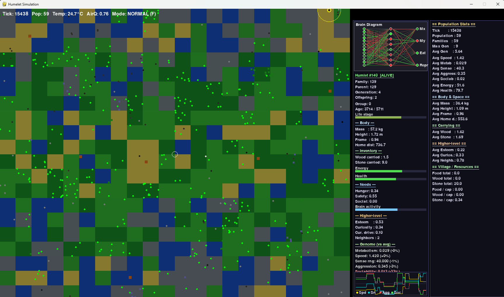
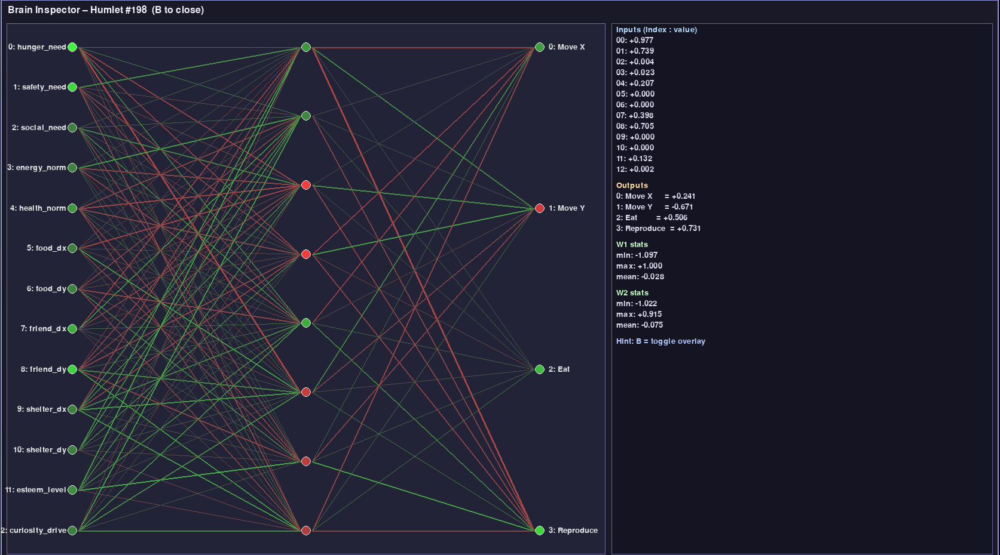

# Humlet Simulation

An agent-based artificial life experiment where *humlets* forage, interact, and evolve inside a biome-rich world. Each individual carries a mutable genome, metabolizes energy, senses its surroundings, and decides its actions through a compact feed-forward neural controller. The simulation visualizes emergent demographics, spatial ecology, and brain activations in real time.




## Model overview

### Environment
- Continuous 2D world discretized into a coarse grid of *regions* that encode biome, fertility, humidity, roughness, and temperature offsets. Each region influences background rendering, resource clustering, and local carrying capacity.
- Diurnal and seasonal cycles modulate `light_level`, `temperature`, and food respawn, forcing agents to cope with fluctuating energy budgets.
- A central village hub aggregates communal stores of food, wood, and stone; totals and per-capita reserves are shown in the right-hand inspector panel.
- Static resources (trees and stone deposits) spawn biome-aware clusters, while consumable food is replenished stochastically with an upper bound (`max_food`).

### Agents (humlets)
- Physiology: health and energy homeostasis governed by per-genome `metabolism_rate`, `speed_trait`, and `sense_range`. Aging and lifespan track senescence, and `base_mass`/`base_height` + `frame_factor` provide body composition parameters.
- Neuro-behavior: a fixed-topology neural network (13 inputs → 8 hidden → 4 outputs) receives need signals (hunger, safety, social), normalized vitals, directional cues to nearby food/friends/shelter, and higher-level drives (esteem, curiosity). Outputs drive planar movement and discrete actions (eat, reproduce).
- Genetics: asexual reproduction with mutation on continuous traits, lineage identifiers (`family_id`, `parent_id`, `generation`), and speciation based on genetic distance. Newborns inherit brains/traits with stochastic perturbations, enabling evolutionary drift under resource pressure.
- Sensors: radial smell and raycast-inspired vision estimate relative offsets to salient objects and conspecifics; sense range gates detection radius and feeds the neural controller.

### Population statistics and visualization
- Per-tick aggregations track births, deaths, mean trait values, and family counts (`EvolutionStats`).
- A biome-aligned heatmap accumulates per-region mean metabolic rate, speed, sensory acuity, sociability, or aggression (`RegionTraitStats`), allowing ecological niches to be visualized dynamically.
- Inspectors expose an individual's genome, vitals, inventory, needs, and instantaneous brain activations. A separate brain overlay renders the weighted neural graph to aid qualitative debugging.

## Running the simulation

### Prerequisites
- Python 3.10+
- Dependencies: `pygame` for rendering, `numpy` for neural math, and `matplotlib` for the HTML/PNG telemetry reports. Install with:

```bash
pip install pygame numpy matplotlib
```

### Start the simulator

From the repository root, launch the pygame window with the desired world dimensions and initial population:

```bash
python main.py
```

Defaults create a 1200×1000 world with 100 humlets. Adjust `world_width`, `world_height`, or `num_humlets` in `main.py` to explore different densities.

### Controls
- **Left click**: select the nearest humlet in the world pane.
- **B**: toggle the large brain overlay for the selected individual.
- **H**: cycle trait heatmaps (`met`, `spd`, `sns`, `soc`, `agg`, or none).
- **R**: write an on-demand telemetry report (HTML + charts) to the current run folder.
- **P**: pause/resume simulation updates.
- **F**: fast-forward (multiple simulation steps per frame).
- **V**: toggle framerate display (helpful when profiling with fast mode).
- **Esc** or **Q**: close the brain overlay, then quit.

### Telemetry and reports
- Every run writes a SQLite telemetry database plus summary artifacts under `reports/run_<timestamp>`. Snapshot rows capture population totals, trait averages, carrying capacity, and food/stone/tree counts; death events log causes, ages, and vital signs at demise.
- Press **R** at any time (or simply quit the window) to finalize a run and generate `summary.html` alongside PNG charts for population, death causes, and age-at-death histograms.
- The top HUD shows the active run ID and whether recording is on; inspector panels expose both individual and aggregate village stores to contextualize the rendered world.

## File map
- `main.py`: entrypoint that configures a `Simulation` instance and starts the loop.
- `humlet_simulation/simulation.py`: orchestrates the world, event loop, rendering (biomes, agents, panels, overlays), and per-step updates.
- `humlet_simulation/humlet.py`: defines the agent genome, physiology, neural controller, sensors, and reproduction/mutation logic.
- `humlet_simulation/environment.py`: models biome tiles, diurnal/seasonal dynamics, and static/consumable resources.
- `humlet_simulation/stats.py`: tracks evolutionary statistics and spatial trait aggregation.
- `humlet_simulation/sensors/`: sensor implementations (smell, vision) used by the neural controller.
- `humlet_simulation/screenshots/`: reference captures of the running simulation and brain inspector.

## Scientific notes
- The model couples metabolic drain with locomotor speed and sensory range, enforcing energetic trade-offs typical in ecological physiology.
- Fitness is emergent: survival depends on foraging efficiency, social proximity, and shelter use under time-varying climate; reproduction is unconstrained beyond energy/health thresholds, allowing selection to act implicitly on viable strategies.
- Spatial heterogeneity (biomes + clustered resources) and toroidal topology encourage niche formation and dispersal dynamics without boundary effects.

## Acknowledgments
This simulation is inspired by, and indebted to, the original "The Bibites" artificial life project created by Rémi Verschelde (Akelle). Their work on evolving digital organisms provided the conceptual spark and many of the design cues for humlets.
